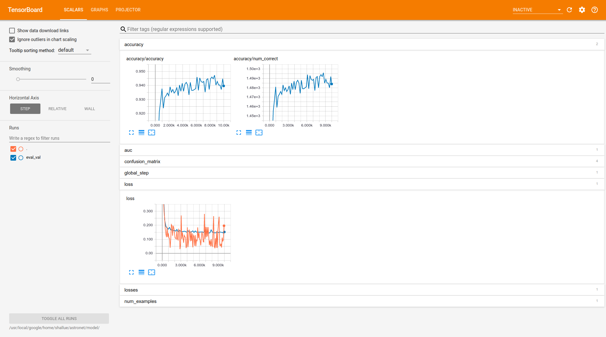

# AstroNetK2: A Neural Network for Identifying Exoplanets in K2 Light Curves

## Contact

Anne Dattilo: [@aedattilo](https://github.com/aedattilo)

## Background

This repository contains TensorFlow models and data processing code for
identifying exoplanets in astrophysical light curves from K2 data. For complete background,
see [our paper](https://arxiv.org/pdf/1903.10507.pdf) in
*The Astronomical Journal*.

This code is modified from [Shallue & Vanderburg (2018)](https://ui.adsabs.harvard.edu/abs/2018AJ....155...94S/abstract). Because of this, some documentation still refers to Kepler instead of K2. 

For a full walkthrough of Astronet, refer to [exoplanet-ml](https://github.com/cshallue/exoplanet-ml). It is written for Tensorflow 1.4 and is compatible with both Python 2 and 3. 

## Citation

If you find this code useful, please cite our paper:

Dattilo, A., Vanderburg, A., et. al. (2019). Identifying Exoplanets with Deep Learning. II. 
Two New Super-Earths Uncovered by a Neural Network in K2 Data.
*The Astronomical Journal*, 157(5), 169.


## Code Directories

[astronet/](astronet/)

* [TensorFlow](https://www.tensorflow.org/) code for:
  * Preprocessing K2 data.
  * Building different types of neural network classification models.
  * Training and evaluating a new model.
  * Using a trained model to generate new predictions.

[light_curve_util/](light_curve_util)

* Utilities for operating on light curves. These include:
  * Reading Kepler data from `.idl` files.
  * Applying a median filter to smooth and normalize a light curve.
  * Phase folding, splitting, removing periodic events, etc.
* In addition, some C++ implementations of light curve utilities are located in
[light_curve_util/cc/](light_curve_util/cc).

[third_party/](third_party/)

* Utilities derived from third party code.


### Required Packages

First, ensure that you have installed the following required packages:

* **TensorFlow** ([instructions](https://www.tensorflow.org/install/))
* **Pandas** ([instructions](http://pandas.pydata.org/pandas-docs/stable/install.html))
* **NumPy** ([instructions](https://docs.scipy.org/doc/numpy/user/install.html))
* **AstroPy** ([instructions](http://www.astropy.org/))
* **PyDl** ([instructions](https://pypi.python.org/pypi/pydl))
* **Bazel** ([instructions](https://docs.bazel.build/versions/master/install.html))
* **Abseil Python Common Libraries** ([instructions](https://github.com/abseil/abseil-py))
    * Optional: only required for unit tests.

### Optional: Run Unit Tests

Verify that all dependencies are satisfied by running the unit tests:

```bash
bazel test astronet/... light_curve_util/... third_party/...
```

### Download and Process K2 Data

Processsed lightcurves are provided under [tfrecord](tfrecord/)

K2 lightcurves can be dowloaded from the [Mikulski Archive for Space Telescopes](https://archive.stsci.edu/),

`K2_candidates.csv` contains the EPIC IDs and parameters of all targets used in Dattilo (2019). The provided code will process lightcurves from `.idl` files.


### Process Kepler Data

If you would like to process your own data, here is how. Otherwise, skip to Training.

To train a model to identify exoplanets, you will need to provide TensorFlow
with training data in
[TFRecord](https://www.tensorflow.org/programmers_guide/datasets) format. The
TFRecord format consists of a set of sharded files containing serialized
`tf.Example` [protocol buffers](https://developers.google.com/protocol-buffers/).

The command below will generate a set of sharded TFRecord files for the TCEs in
the training set. Each `tf.Example` proto will contain the following light curve
representations:

* `global_view`: Vector of length 701: a "global view" of the TCE.
* `local_view`: Vector of length 51: a "local view" of the TCE.

In addition, each `tf.Example` will contain the value of each column in the
input TCE CSV file. The columns include:

* `rowid`: Integer ID of the row in the TCE table.
* `kepid`: Kepler ID of the target star.
* `tce_plnt_num`: TCE number within the target star.
* `av_training_set`: Autovetter training set label.
* `tce_period`: Period of the detected event, in days.

```bash
# Use Bazel to create executable Python scripts.
#
# Alternatively, since all code is pure Python and does not need to be compiled,
# we could invoke the source scripts with the following addition to PYTHONPATH:
#     export PYTHONPATH="/path/to/source/dir/:${PYTHONPATH}"
bazel build astronet/...

# Directory to save output TFRecord files into.
TFRECORD_DIR="${HOME}/astronet/tfrecord"

# Preprocess light curves into sharded TFRecord files using 5 worker processes.
bazel-bin/astronet/data/generate_input_records \
  --input_tce_csv_file=${TCE_CSV_FILE} \
  --kepler_data_dir=${KEPLER_DATA_DIR} \
  --output_dir=${TFRECORD_DIR} \
  --num_worker_processes=5
```

When the script finishes you will find 8 training files, 1 validation file and
1 test file in `TFRECORD_DIR`. The files will match the patterns
`train-0000?-of-00008`, `val-00000-of-00001` and `test-00000-of-00001`
respectively.


### Train an AstroNet Model

The [astronet](astronet/) directory contains several types of neural
network architecture and various configuration options. To train a convolutional
neural network to classify K2 TCEs as either "planet" or "not planet",
run the following training script:

```bash
# Directory to save model checkpoints into.
MODEL_DIR="${HOME}/astronet/model/"

# Run the training script.
bazel-bin/astronet/train \
  --model=AstroCNNModel \
  --config_name=local_global \
  --train_files=${TFRECORD_DIR}/train* \
  --eval_files=${TFRECORD_DIR}/val* \
  --model_dir=${MODEL_DIR}
```

Optionally, you can also run a [TensorBoard](https://www.tensorflow.org/programmers_guide/summaries_and_tensorboard)
server in a separate process for real-time
monitoring of training progress and evaluation metrics.

```bash
# Launch TensorBoard server.
tensorboard --logdir ${MODEL_DIR}
```

The TensorBoard server will show a page like this:



### Evaluate an AstroNetK2 Model

Run the following command to evaluate a model on the test set. The result will
be printed on the screen, and a summary file will also be written to the model
directory, which will be visible in TensorBoard.

```bash
# Run the evaluation script.
bazel-bin/astronet/evaluate \
  --model=AstroCNNModel \
  --config_name=local_global \
  --eval_files=${TFRECORD_DIR}/test* \
  --model_dir=${MODEL_DIR}
```

The output should look something like this:

```bash
INFO:tensorflow:Saving dict for global step 10000: accuracy/accuracy = 0.9625159, accuracy/num_correct = 1515.0, auc = 0.988882, confusion_matrix/false_negatives = 10.0, confusion_matrix/false_positives = 49.0, confusion_matrix/true_negatives = 1165.0, confusion_matrix/true_positives = 350.0, global_step = 10000, loss = 0.112445444, losses/weighted_cross_entropy = 0.11295206, num_examples = 1574.
```
